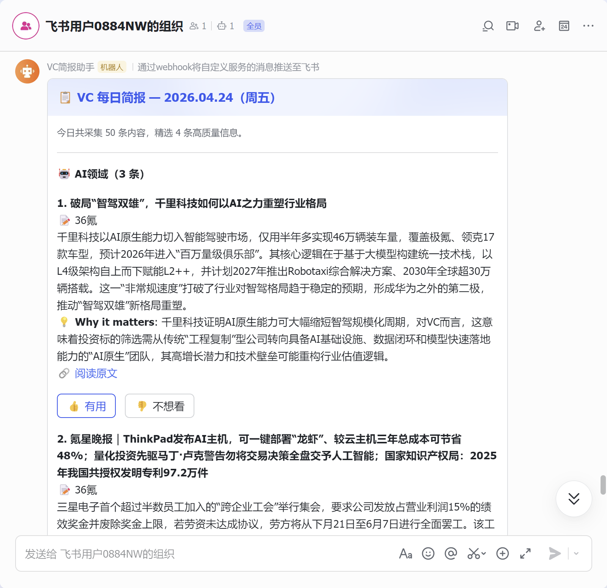

# VC Info Agent

[中文版](#中文说明)

An AI-powered information aggregation agent for venture capital professionals. Automatically collects content from YouTube and RSS feeds, filters noise, generates structured daily briefings with investment insights using LLM, and delivers via Feishu.

## Architecture

```
Scheduler (Cron)
       │
       ├── YouTube Collector (API v3: channel subscriptions + keyword search)
       ├── RSS Collector (TechCrunch, MIT Tech Review, 36氪, 量子位...)
       │
       ▼
Content Filter (multi-dimensional scoring + user preference weights)
       │
       ▼
LLM Summarizer (DeepSeek — structured summary + "Why it matters")
       │
       ▼
Brief Generator (Markdown) ──→ Feishu Webhook
       │
       ▼
Feedback Loop (👍👎 → preference learning → filter weight adjustment)
```

## Project Structure

```
vc-info-agent/
├── README.md
├── design.md              ← System design document
├── requirements.txt
├── .env.example
├── src/
│   ├── main.py            ← Pipeline entry point
│   ├── scheduler.py       ← 24/7 auto-run (APScheduler, daily 08:00)
│   ├── config.py          ← System config (loads sources.yaml)
│   ├── sources.yaml       ← Info source config (channels, keywords, RSS)
│   ├── collector.py       ← YouTube collector (channel + keyword modes)
│   ├── rss_collector.py   ← RSS feed collector
│   ├── filter.py          ← Quality scoring + feedback integration
│   ├── summarizer.py      ← LLM summarization + briefing generation
│   ├── delivery.py        ← Feishu interactive card push
│   ├── feedback.py        ← User feedback CLI + preference store
│   └── feedback_server.py ← HTTP feedback service (for Feishu button callbacks)
├── data/
│   └── feedback.json      ← User preference data (auto-generated)
└── sample_output/
    └── briefing_2026-04-24.md
```

## Quick Start

### Prerequisites

- Python 3.10+
- YouTube Data API v3 key ([get one here](https://console.cloud.google.com/apis/credentials))
- DeepSeek API key ([get one here](https://platform.deepseek.com/api_keys)), or any OpenAI-compatible LLM

### Setup

```bash
cd vc-info-agent
python -m venv .venv
source .venv/bin/activate  # Windows: .venv\Scripts\activate
pip install -r requirements.txt
cp .env.example .env
# Edit .env with your API keys
```

### Run

```bash
cd src
python main.py
```

The briefing is saved to `sample_output/briefing_YYYY-MM-DD.md`.

### Provide Feedback

```bash
cd src
python feedback.py
```

Review the latest briefing and mark items as 👍 like / 👎 dislike. Preferences are saved to `data/feedback.json` and influence future content ranking.

### Feishu Push (Optional)

Set `FEISHU_WEBHOOK` in `.env` to automatically push briefings to a Feishu group chat.

## Briefing Preview

Feishu card message with feedback buttons:



## Design Highlights

- **Dual-mode YouTube collection**: Channel subscriptions (precise, low API cost) + keyword search (broad coverage)
- **Multi-source aggregation**: YouTube + RSS feeds covering English and Chinese tech media
- **Investment-focused summaries**: Each item includes "Why it matters" from a VC perspective
- **Feedback-driven personalization**: User reactions adjust content ranking weights over time
- **Mobile-friendly briefing**: Designed for 5-minute reading on phone

See [design.md](design.md) for the full system design document.

## Deployment (24/7)

```bash
# Terminal 1: Feedback server
cd src && python feedback_server.py

# Terminal 2: Cloudflare Tunnel for feedback service
cloudflared tunnel --url http://localhost:9002

# Terminal 3: Scheduler (runs pipeline daily at 08:00)
cd src && python scheduler.py
```

Set `FEEDBACK_BASE_URL` in `.env` to the tunnel's public URL.

## Folder Reference

| Path | Purpose |
|------|---------|
| `src/` | All source code |
| `src/sources.yaml` | Info source config (channels, keywords, RSS feeds) — edit this to customize |
| `data/` | Auto-generated runtime data (feedback.json for user preferences) |
| `sample_output/` | Generated briefings (Markdown files) |
| `docs/` | Screenshots and documentation assets |

---

# 中文说明

[English Version](#vc-info-agent)

面向 VC 投资人的 AI 信息聚合 Agent。自动从 YouTube 和 RSS 源采集内容，过滤噪音，通过 LLM 生成带投资洞察的结构化每日简报，支持飞书推送。

## 快速开始

### 环境要求

- Python 3.10+
- YouTube Data API v3 密钥
- DeepSeek API 密钥（或任何 OpenAI 兼容 LLM）

### 安装运行

```bash
cd vc-info-agent
python -m venv .venv
source .venv/bin/activate  # Windows: .venv\Scripts\activate
pip install -r requirements.txt
cp .env.example .env       # 编辑 .env 填入 API Key
cd src && python main.py
```

### 提供反馈

```bash
python feedback.py         # 回放简报，标记 👍👎
```

反馈数据保存在 `data/feedback.json`，会影响后续内容排序。

## 设计亮点

- **YouTube 双模式采集**：频道订阅（精准、低 API 消耗）+ 关键词搜索（广覆盖）
- **多源聚合**：YouTube + RSS，覆盖中英文科技媒体
- **投资视角摘要**：每条内容附 "Why it matters" 分析
- **反馈驱动个性化**：用户反馈动态调整内容排序权重
- **手机友好**：简报控制在 5 分钟内读完

完整系统设计见 [design.md](design.md)。
